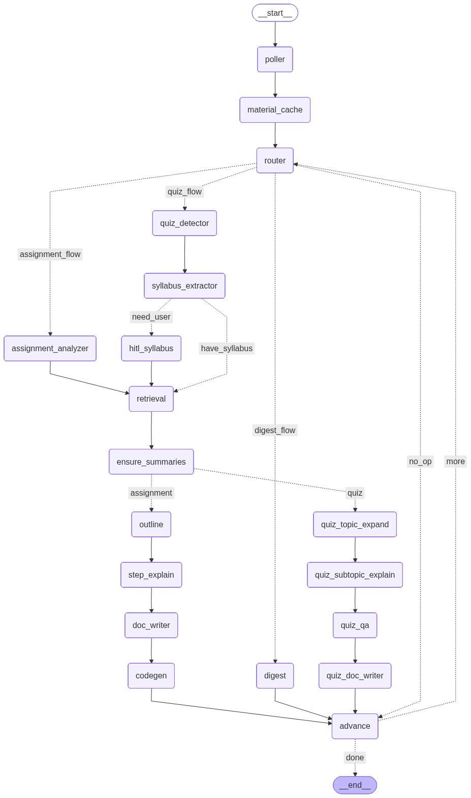

# Automating Classroom Updates

This project automates Google Classroom updates using a modular multi‑agent workflow. It polls all **ACTIVE** courses you are registered in, detects new events, builds study/assignment artifacts, and keeps a local cache of generated notes and scaffolding code.

The workflow is production‑oriented: it uses SQLite for state, a cache directory for artifacts, and a CLI entry point to control runtime behavior.

## What It Does

- Lists all ACTIVE courses and processes each course independently.
- Polls announcements, coursework, and course materials.
- Routes events into:
  - Quiz flow (topic expansion, subtopic explanations, critical QA)
  - Assignment flow (analysis, outline, step explanations, document + code scaffold)
  - Digest flow (summary of recent updates)
- Tracks already seen events to avoid duplicate processing.
- Runs continuously in the background on a fixed interval (default 3.5 hours).

## Project Layout

- `main.py`
  CLI entry point for the workflow.
- `agents/`
  - `auth.py`: OAuth and API client creation
  - `config.py`: Settings dataclass
  - `db.py`: SQLite schemas and helpers
  - `tools.py`: API + file tools
  - `prompts.py`: Prompt templates for agents
  - `agents.py`: LLM agent setup
  - `workflow.py`: LangGraph workflow
  - `runner.py`: polling loop and course iteration

## Workflow Diagram



## Installation

### 1) Create and activate a Python environment

```bash
python -m venv .venv
source .venv/bin/activate
```

### 2) Install dependencies

```bash
pip install -r requirements.txt
```

### 3) Configure Google API credentials

- Place `credentials.json` in the project root.
- The first run will open a browser for OAuth and create `token.json`.

### 4) Optional: Ensure PDF rendering support

PDF generation uses Pandoc + XeLaTeX. Install if you want PDFs.

- macOS:
```bash
brew install pandoc mactex
```

If Pandoc is missing, the workflow will still run but PDF generation may fail.

## Usage

### List active courses

```bash
python main.py --list-courses
```

### Run once across all ACTIVE courses

```bash
python main.py --once
```

### Run continuously (default every 3.5 hours)

```bash
python main.py
```

### Run for specific course IDs

```bash
python main.py --once --course-ids "123456,987654"
```

### Run in the background

```bash
nohup python main.py > classroom.log 2>&1 &
```

## CLI Arguments

- `--credentials` path to `credentials.json`
- `--token` path to `token.json`
- `--db-path` path to SQLite DB
- `--cache-dir` cache directory for artifacts
- `--course-ids` comma-separated list of course IDs (optional)
- `--once` run a single pass and exit
- `--poll-hours` polling interval in hours
- `--allow-hitl` enable interactive input if syllabus is missing
- `--model` LLM model name
- `--list-courses` list active courses and exit

## Output Artifacts

All generated artifacts are stored in the cache directory (default: `cache_files/`).

- Quiz flow:
  - `*_quiz.md`, `*_quiz.pdf`
- Assignment flow:
  - `*.md`, `*.pdf`
  - `*_scaffold.py` (initial code scaffold)
  - `*_scaffold.md` (codegen notes + step snippets)

## Workflow Details

### Polling & Deduplication

Each course uses a per‑course checkpoint key (e.g., `poll:last_ts:<course_id>`). New events are only processed once and stored in the local SQLite DB.

### Quiz Flow Improvements

- Topics are expanded into subtopics and learning objectives.
- Subtopics receive detailed explanations.
- QA generation now targets:
  - 15–20 conceptual questions
  - 5–10 numerical questions
  - non‑vague, critical questions across all topics

### Assignment Flow Improvements

- Assignment analysis → outline → step explanations → document
- **Codegen agent** runs at the end of the assignment pipeline:
  - Generates scaffolding per step
  - Stitches into an initial `scaffold.py`

## Notes

- The workflow uses `langchain-nvidia-ai-endpoints`. Ensure your environment is configured to access the model.
- If you want to disable PDF generation entirely, remove Pandoc or stub `render_markdown_to_pdf` in `agents/tools.py`.

## Quick Start

```bash
pip install -r requirements.txt
python main.py --once
```
